# UML Diagram ระบบตรวจสอบเสียงสังเคราะห์ภาษาไทย

โครงงาน SI423-59 | Thai Synthetic Voice Detection System Using Machine Learning

> **ขอบเขตของเอกสารนี้**
> ทุกไดอะแกรมอ้างอิงจาก**โค้ดที่มีอยู่จริงและผ่านการทดสอบแล้ว** (96 unit tests)
> ส่วนที่ยังไม่ได้พัฒนาจะระบุกำกับไว้ว่า *(อยู่นอกขอบเขต / ยังไม่พัฒนา)*

---

## สารบัญ

| # | ไดอะแกรม | ประเภท UML | ตอบคำถามอะไร |
|---|---|---|---|
| 1 | Use Case Diagram | Behavioural | ใครทำอะไรกับระบบได้บ้าง |
| 2 | Context & Data Flow Diagram | Structured Analysis | ข้อมูลไหลจากไหนไปไหน |
| 3 | Class Diagram | Structural | โค้ดมีคลาสอะไร สัมพันธ์กันอย่างไร |
| 4 | Activity Diagram | Behavioural | ขั้นตอนการทำงานตั้งแต่ต้นจนจบ |
| 5 | Sequence Diagram (Offline) | Interaction | ลำดับการคุยกันของแต่ละส่วนในโหมดปกติ |
| 6 | Sequence Diagram (Near Real-Time) | Interaction | ลำดับการคุยกันในโหมด streaming |
| 7 | State Machine Diagram | Behavioural | สถานะของ session การเฝ้าฟังสด |
| 8 | Component Diagram | Structural | โมดูลซอฟต์แวร์และ interface ระหว่างกัน |
| 9 | Deployment Diagram | Structural | ซอฟต์แวร์ไปรันอยู่บนอะไร |
| 10 | Training Pipeline Activity | Behavioural | ขั้นตอนฝั่งวิจัย (เทรน → export) |

---

## 1. Use Case Diagram

แสดงความสามารถของระบบแยกตาม actor
Mermaid ไม่มีสัญลักษณ์ use case มาตรฐาน จึงใช้ flowchart แทน โดยวงรี `(...)` = use case

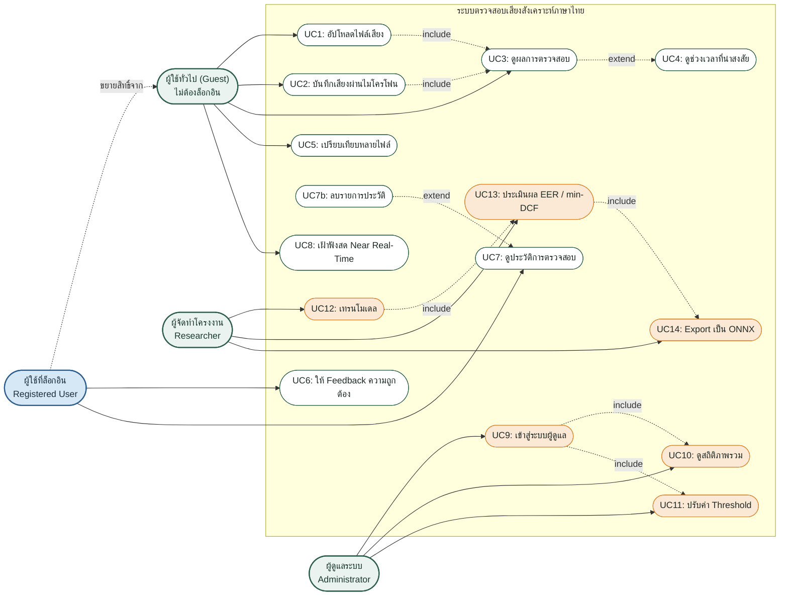

**หมายเหตุการออกแบบ**
- UC1–UC5, UC8 **ไม่ต้อง login** ตามหลัก Data Minimization (พ.ร.บ. คุ้มครองข้อมูลส่วนบุคคล)
- UC6, UC7, UC7b **ต้อง login** Feedback และประวัติต้องผูกกับ `user_id` ในฐานข้อมูล guest ไม่สามารถดำเนินการใด ๆ เหล่านี้ได้ (API คืน 401 ถ้าไม่มี token)
- UC7b (ลบประวัติ) เป็น extend ของ UC7: ผู้ใช้ลบได้เฉพาะรายการของตนเอง การลบจะลบ SegmentScore และ Feedback ที่เกี่ยวข้องด้วย (cascade)
- UC9–UC11 **ต้อง login (Admin)** เพราะกระทบระบบส่วนรวม (RBAC แบบชั้นเดียว)
- UC12–UC14 เป็นงานฝั่งวิจัย ทำผ่าน command line ไม่ได้อยู่ในเว็บแอป

---

## 2. Context Diagram และ Data Flow Diagram

### 2.1 Context Diagram (DFD Level 0)

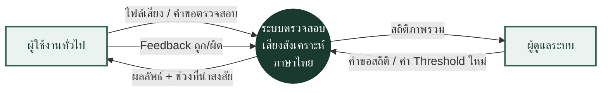

### 2.2 Data Flow Diagram (DFD Level 1)

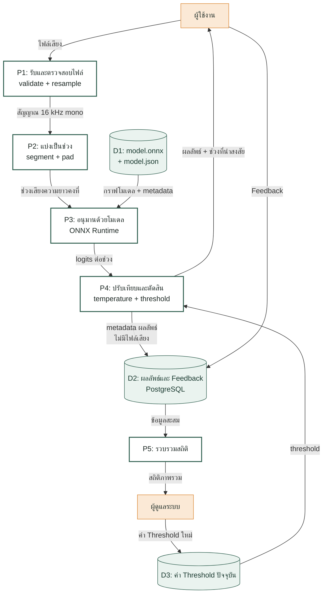

> **จุดสำคัญด้านความเป็นส่วนตัว** ไม่มีลูกศรใดที่ส่ง "ไฟล์เสียง" เข้าสู่ D2
> ไฟล์เสียงถูกใช้แล้วปล่อยทิ้งใน memory ทันที (ดู `scripts/serve_fastapi.py`)

---

## 3. Class Diagram

อ้างอิงจากคลาสจริงในโปรเจกต์ แยกเป็น 3 กลุ่มตามหน้าที่

### 3.1 กลุ่มจัดการข้อมูล (`src/data/`)

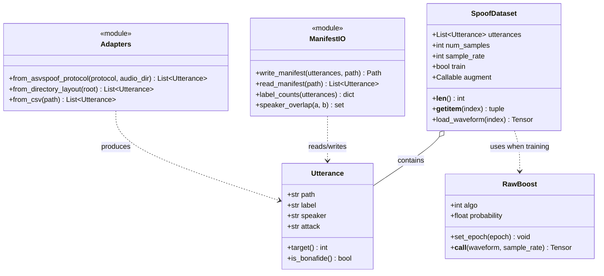

### 3.2 กลุ่มโมเดล (`src/models/`)

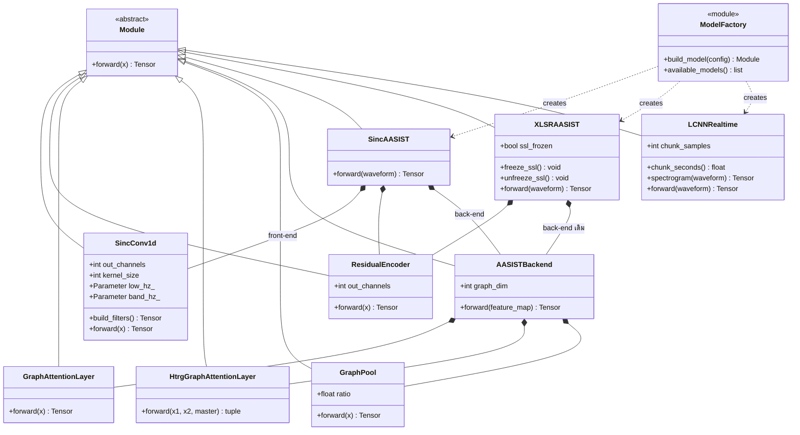

> **จุดที่ไดอะแกรมนี้อธิบายได้ชัดกว่าคำพูด** `SincAASIST` กับ `XLSRAASIST`
> ใช้ `AASISTBackend` **ตัวเดียวกัน** ต่างกันแค่ front-end

### 3.3 กลุ่มอนุมานและ serving

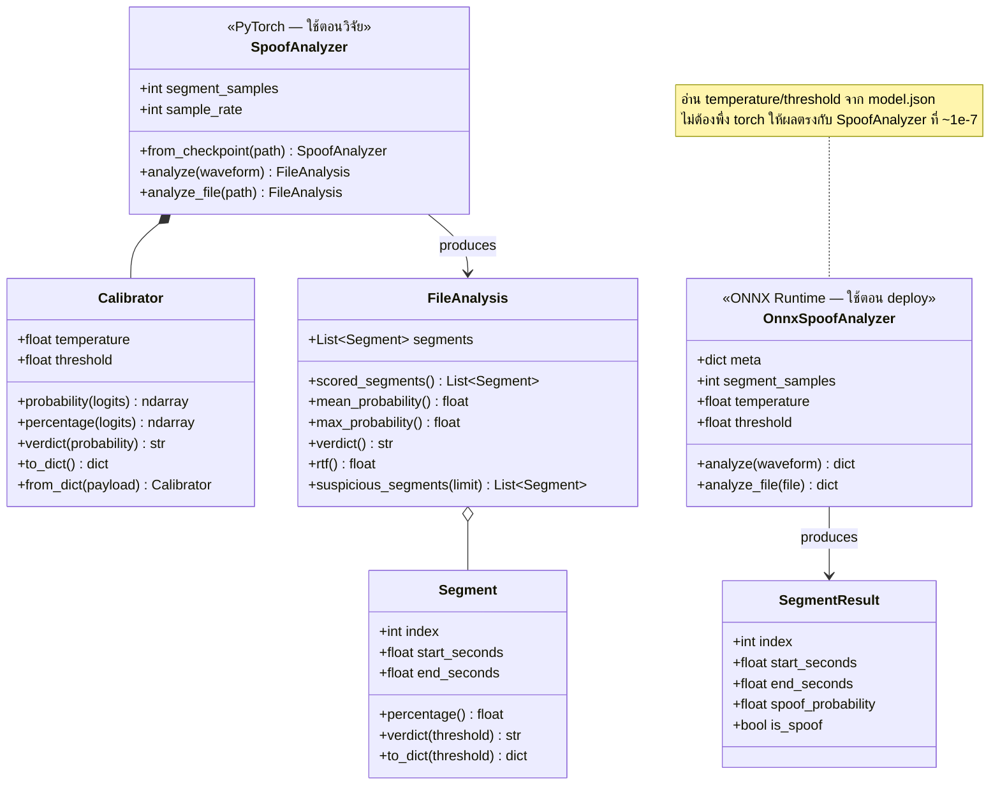

---

## 4. Activity Diagram การตรวจสอบไฟล์เสียง

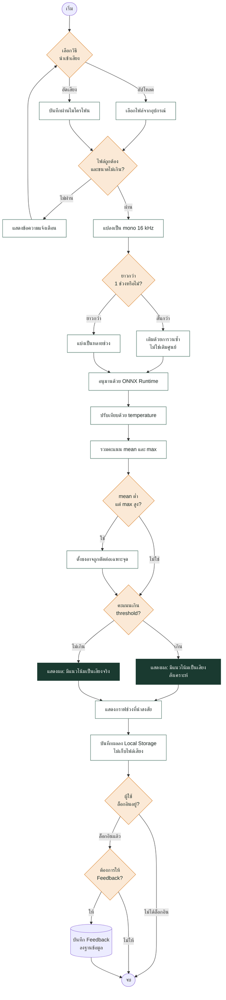

---

## 5. Sequence Diagram โหมดปกติ (Offline / Post-hoc)

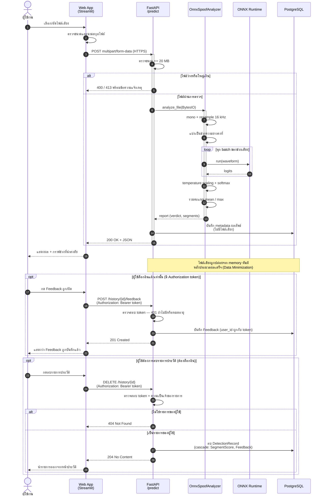

---

## 6. Sequence Diagram โหมด Near Real-Time

> *(สถานะ: ยังเป็นการศึกษาเชิงสำรวจ — ยังไม่มีงานวิจัยรองรับในบริบทภาษาไทย)*

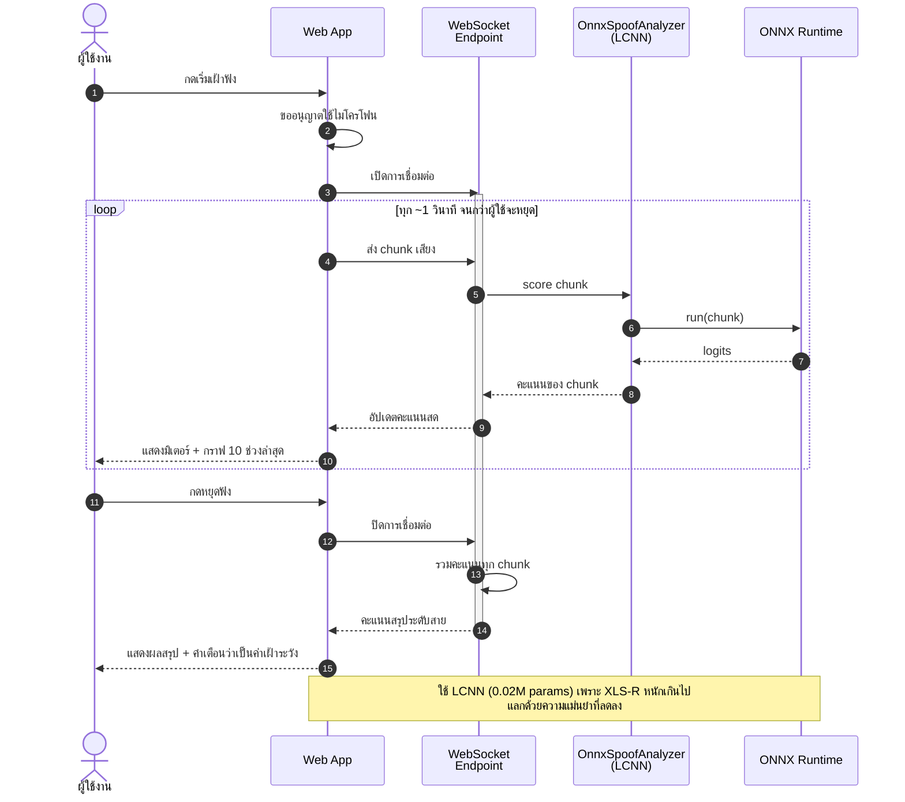

---

## 7. State Machine Diagram Session การเฝ้าฟังสด

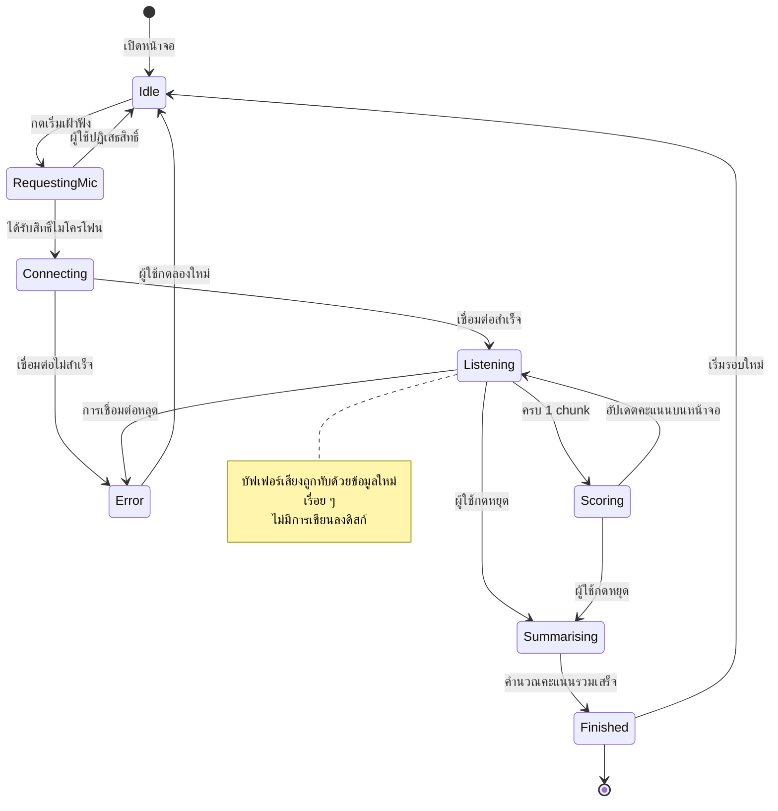

---

## 8. Component Diagram

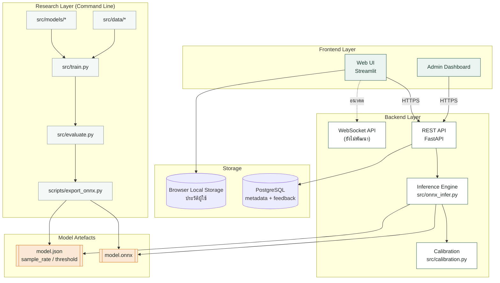

> Research Layer กับ Backend Layer **ไม่แชร์ dependency กัน**
> ฝั่ง deploy ต้องการแค่ `onnxruntime + numpy + soundfile` ไม่ต้องติดตั้ง
> `torch` และ `transformers` (ประหยัดหลาย GB และ cold start เร็วกว่ามาก)

---

## 9. Deployment Diagram

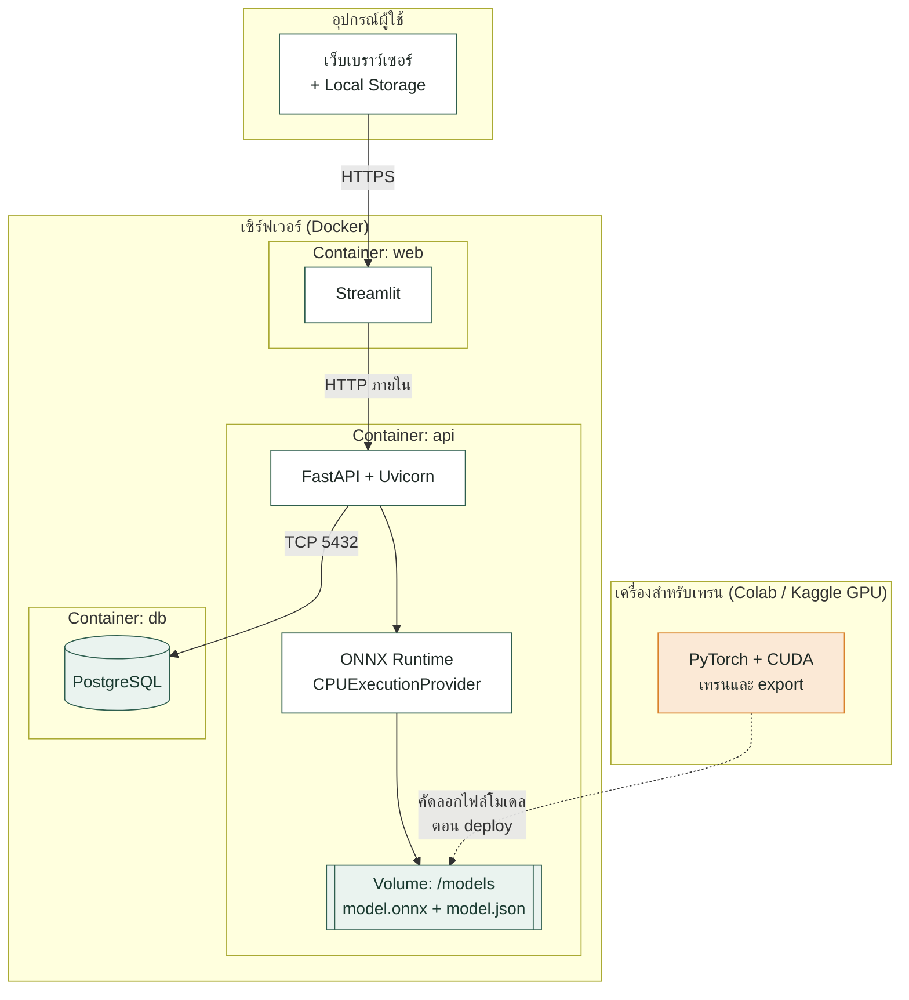

---

## 10. Activity Diagram ขั้นตอนฝั่งวิจัย (เทรน → Export)

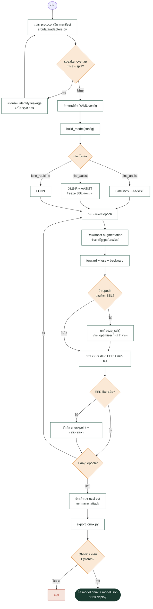

---

## ภาคผนวก: ตารางตรวจสอบขอบเขต

| ส่วน | สถานะในโค้ดจริง | อ้างอิงไฟล์ |
|---|---|---|
| SincConv + AASIST | พัฒนาและทดสอบแล้ว | `src/models/sinc_aasist.py` |
| XLS-R + AASIST | พัฒนาและทดสอบแล้ว | `src/models/xlsr_aasist.py` |
| LCNN (real-time) | พัฒนาและทดสอบแล้ว | `src/models/realtime.py` |
| RawBoost augmentation | พัฒนาและทดสอบแล้ว | `src/data/rawboost.py` |
| EER / min-DCF | พัฒนาและทดสอบแล้ว | `src/metrics/eer.py` |
| Temperature calibration | พัฒนาและทดสอบแล้ว | `src/calibration.py` |
| ONNX export + parity check | พัฒนาและทดสอบแล้ว | `scripts/export_onnx.py` |
| ONNX inference engine | พัฒนาและทดสอบแล้ว | `src/onnx_infer.py` |
| FastAPI backend | ตัวอย่างอ้างอิง ทดสอบรันได้ | `scripts/serve_fastapi.py` |
| Streamlit UI | **ยังไม่พัฒนา** (มีเพียง UX mockup) | — |
| PostgreSQL + Feedback | **ยังไม่พัฒนา** | — |
| WebSocket streaming | **ยังไม่พัฒนา** (ออกแบบไว้เท่านั้น) | — |
| Admin authentication | **ยังไม่พัฒนา** | — |

> ไดอะแกรมที่ 6, 7 และส่วนที่ทำเครื่องหมาย *(ยังไม่พัฒนา)* เป็นการออกแบบล่วงหน้า
